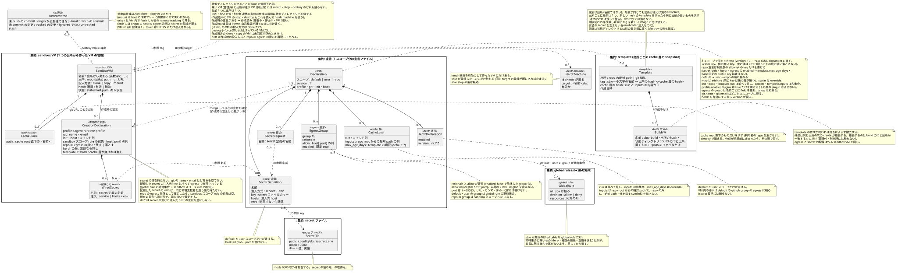
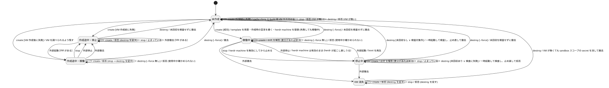

# sbxr の設計

sbxr（repo を宣言 1 枚で AI coding agent 用の sandbox VM にする CLI）の設計ドキュメント一式。システム関連図 → ユースケース → ドメインモデル図の順で作った。

範囲は、実装済みの v0.1 に次の 4 つを足したもの。

- #9（回収）: host へ取り込む fetch をやめ、repo の投入方式と destroy 前の未回収の検査に置き換えた
- #12（egress 自己検証）
- #13（init の cache 層を template に焼く）
- repo の投入方式（clone・copy・mount）

語は [CONTEXT.md](../../../CONTEXT.md)、リポジトリ全体の設計判断は [docs/adr/](../../adr/) を正本とする。

## 索引

構造を変えるときは、下の表で正本の file を引く。実装との順序は [CLAUDE.md](../../../CLAUDE.md) の開発フローに従う。

| file | 中身（正本として扱う構造） |
|---|---|
| [system.md](system.md) | 境界、相手ごとの接続と port、状態機械の概要、未実測の前提 |
| [usecases.md](usecases.md) | ユースケース（UC1〜UC7）の Main Success Scenario と Extensions |
| [domain.puml](domain.puml) / domain.svg | entity・集約の範囲・多重度・ID 参照・不変条件 |
| [statechart.puml](statechart.puml) / statechart.svg | sandbox VM の状態機械（状態・イベント・guard・uncovered 宣言） |
| [decision/](decision/) | この設計で決めたことの根拠と却下肢（1 決定 1 file、不変） |
| [CONTEXT.md](../../../CONTEXT.md) | 図と地の文に出る語 |

## ドメインモデル図

正本は `domain.puml` で、`domain.svg` は生成物。直すのは `.puml` の側で、直したら `.svg` を描き直す。

## 状態遷移図

正本は `statechart.puml`。直したら組合せ検査（`check-statechart.py`）を通してから描き直す。

## 検証シナリオ

出所の hash は例示の短縮形（`/Users/u/src/app` → `1a2b`）で書く。具体的な ID と状態を入れた遷移列で、ドメインモデル図と状態機械が矛盾なく表現できるかを確かめる。見るのは、多重度・集約の境界・系譜。

### シナリオ 1: cache 層を変えて作り直す（正常系と、未回収による停止）

path の repo `/Users/u/src/app` の宣言は `template: {inputs: [.mise.toml], run: [mise install]}`。投入方式は clone。

1. `sbxr create /Users/u/src/app`
   - sandbox VM `app` は未作成で、出所 `/Users/u/src/app`（hash `1a2b`）の template の記録は無い
   - build 用 VM `sbxr-build-1a2b`（状態ディレクトリに build の印と出所）に `.mise.toml` だけを置いて `mise install` を走らせ、template `sbxr-app-1a2b:3f9a`（作成日時 2026-10-01）を作る
   - `sbxr-build-1a2b` を撤去する
2. VM `app` を `sbxr-app-1a2b:3f9a` から作る
   - egress 自己検証: `github.com:443` に届き、`example.com:443` に届かない
   - 作成時の宣言（template の hash `3f9a`、投入方式 clone）を書く
   - 状態は、未作成から稼働中になる
3. `sbxr stop` で停止中になる
4. 利用者が `.mise.toml` を変える。`sbxr plan` が drift `template の hash: 3f9a → 7c21` を見せる（UC7）
5. `sbxr destroy`
   - 停止中なので一時起動して検査する。branch `feature/x` に、origin に無い commit が 2 つある
   - 止め直して拒否し、停止中のままになる
6. 利用者が `sbx exec app -- git push origin feature/x` を実行する
   - 外部起動で稼働中になり、push の後に `sbxr stop` で停止中に戻す
   - `sbxr destroy` は一時起動して検査し、未回収が空なので撤去する
   - 未作成になる。template `sbxr-app-1a2b:3f9a` は残る（参照する VM は 0 件）
7. `sbxr create`
   - hash `7c21` の template が無いので、`sbxr-app-1a2b:7c21` を作り、同じ出所の `sbxr-app-1a2b:3f9a` を消す
   - VM `app` を作り直し、作成時の宣言の hash は `7c21` になる

**検査**

- **多重度**: 出所ごとに最新の template は 1 つで、6 の後も 7 の後も成り立つ
- **集約の境界**: template の作成と旧い template の削除（template 集約）は、VM の作成（sandbox VM 集約）より前に別々に終わる。7 で VM の作成に失敗しても、template `7c21` は整合したまま残る
- **系譜**: 7 の VM は同じ名前・同じ出所の新しい実体で、状態ディレクトリは書き直される

### シナリオ 2: egress 自己検証が失敗して作成途中になる（異常系からの復帰）

git URL `https://github.com/acme/api.git` から作る。VM の名前は `api`、cache clone は `~/.cache/sbxr/repos/api/`。user 設定で herdr 連携を有効にしている。

1. `sbxr create --yes https://github.com/acme/api.git`
   - repo の egress を落として作る内容を確定し、secret の値が揃っていることを確かめる
   - 状態ディレクトリに env 定義（herdr の kit を含む）・出所・投入方式 clone を書く。sandbox スコープの secret を置いてから VM `api` を作る
   - init と boot は通る
2. egress 自己検証で、許可外の候補 `example.com:443` に届いてしまう（sbx の global policy が allow-all で初期化されていた）
   - 作成時の宣言を書かずに止まる
   - 作成途中・稼働になる。cache clone と状態ディレクトリは残る
3. `sbxr destroy` は、稼働中なので `--force` 無しでは拒む
4. `sbxr stop` で作成途中・停止になる
5. `sbxr destroy`
   - herdr 連携を有効にして作ったことは、作成の最初に書いた状態ディレクトリから分かる。host の herdr があることを確かめ、`api.sbx` の登録を探す（登録は作成時の宣言の後なので無い）
   - 作成途中なので未回収を検査せずに撤去する
   - sandbox スコープの secret・rule は env 定義ごと消える。cache clone と状態ディレクトリを片付け、未作成になる
6. 利用者が sbx の global policy を直し、`sbxr policy sync` を実行してから `sbxr create --yes` をやり直す
   - 稼働中になる。作成時の宣言には、repo の egress を落とした扱いが記録される

**検査**

- **多重度**: 作成途中の間、作成時の宣言は 0 件で、cache clone は 1 件（状態ディレクトリを書いた後なので destroy で消せる）。herdr machine は 0 件
- **作成途中の読み取り**: herdr 連携の有無を作成時の宣言（0 件）だけに置くと、5 で herdr を扱うべきか決められない。作成の最初に記録する属性として sandbox VM に置いたので表現できる
- **集約の境界**: 2 の失敗で書かれたのは sandbox VM 集約だけで、template 集約は触られていない（cache 層が無い）
- **系譜**: 6 の VM は、5 で撤去した VM とは別の実体で、同じ名前・同じ出所

### シナリオ 3: herdr 連携と、sbxr の外での操作（境界をまたぐ流れ）

path の repo `/Users/u/src/web` を投入方式 mount で作る。user 設定で herdr 連携を有効（`v0.9.0`）にしている。

1. `sbxr create --workspace mount /Users/u/src/web`
   - 確認関門で mount のリスクを示し、利用者が承認する
   - VM `web` が稼働中になり、herdr machine `web.sbx`（id `m-12`）を登録する（有効）
2. `sbxr stop`
   - `m-12` を無効にしてから止め、停止中になる
   - `herdr machine enable m-12` を案内する
3. 利用者が `herdr machine enable m-12` を実行する
   - herdr が繋ぎ直し、外部起動で稼働中になる。boot を再生する
4. 利用者が `sbx rm web` を直接実行する
   - 外部撤去で VM 消失になる
   - 状態ディレクトリと作成時の宣言は残る。`m-12` は有効のまま、繋がらない宛先を指す
5. `sbxr create /Users/u/src/web` は、VM 消失なので destroy を促して止まる
6. `sbxr destroy`
   - mount で、しかも VM 消失なので、未回収を検査しない
   - `m-12` を解除し、VM が無くても sandbox スコープの secret を消す
   - 状態ディレクトリを片付け、未作成になる

**検査**

- **多重度**: herdr machine は sandbox VM ごとに 0..1。4 から 6 の間、VM は無いが、sandbox VM（状態ディレクトリ）が残っているので `m-12` への参照は成り立つ
- **集約の境界**: herdr machine は集約の外の実体で、sbxr は ID（target `web.sbx`）で参照して別の段で更新する

### シナリオ 4: 同じ名前の別 repo が template を持つ（系譜と識別）

`/a/app`（出所の hash `aaaa`）と `/b/app`（出所の hash `bbbb`）は、どちらも VM の名前が `app` になる。どちらの宣言も cache 層を持つ。

1. `sbxr create /a/app`
   - template `sbxr-app-aaaa:3f9a` を作り、VM `app`（出所 `/a/app`）が稼働中になる
2. `sbxr stop /a/app` → `sbxr destroy /a/app`
   - 未回収が空なので撤去し、未作成になる
   - template `sbxr-app-aaaa:3f9a` は残る
3. `sbxr create /b/app`
   - VM `app` は未作成なので進む
   - 出所 `/b/app` の template は無いので、build 用 VM `sbxr-build-bbbb` で `sbxr-app-bbbb:5e6f` を作る
   - 旧いものとして消すのは同じ出所の template だけなので、`sbxr-app-aaaa:3f9a` には触れない
   - VM `app`（出所 `/b/app`）が稼働中になる
4. `sbxr create /a/app`
   - 名前 `app` の状態ディレクトリは `/b/app` のものなので、別出所として触らずに止まる
   - template `sbxr-app-aaaa:3f9a` は残ったまま

**検査**

- **多重度**: 出所ごとに最新の template は 1 つで、`aaaa` と `bbbb` のどちらでも成り立つ
- **系譜**: template の識別は出所で、名前ではない。sandbox VM の側は、名前 1 つに出所 1 つ（別出所を拒否する）のまま
- **残る課題**: 出所ごと使われなくなった template（`/a/app` を二度と作らない場合の `aaaa`）は自動では消えない。利用者が `sbx template rm` で消す

**結論**: 4 シナリオとも矛盾なく表現できる。途中で直したモデルは 3 点ある。

- シナリオ 2 で、herdr 連携の有無が作成時の宣言にしか無いと、作成途中の VM の destroy が herdr machine を扱えない欠陥が見つかった（ADR 0007 の実装は env 定義から判定している）。出所・投入方式と並ぶ、作成の最初に記録する属性に改めた

- シナリオ 4 で、template と build 用 VM を名前で識別すると、別の repo の template を上書き・削除してしまう欠陥が見つかった。識別を出所に改め、build 用 VM に状態ディレクトリ（build の印と出所）を持たせた
- シナリオ 3 の 5 から、現行の実装が VM 消失でも create を「既にある」として drift の報告にしてしまう点が見つかった。状態機械では destroy を促す拒否として定義した（実装は follow-up）
